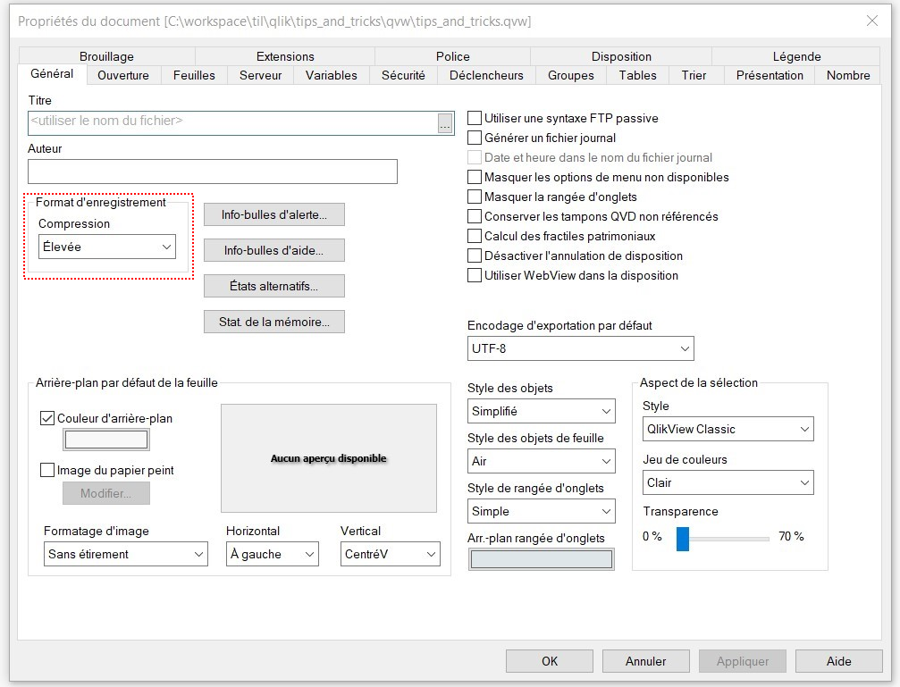
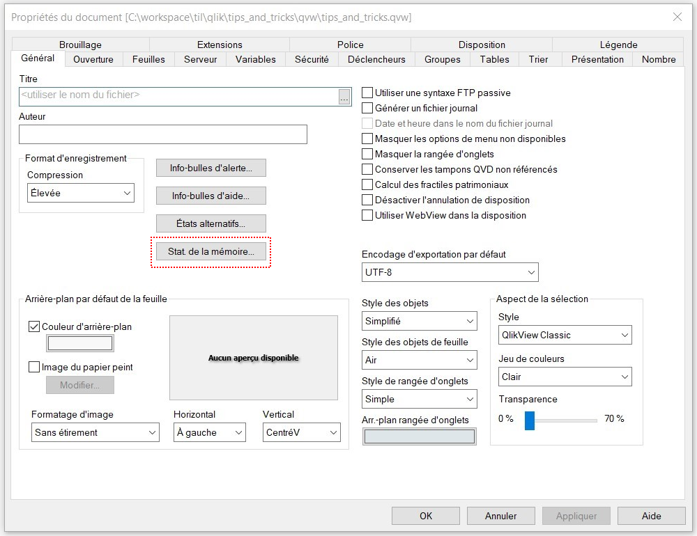
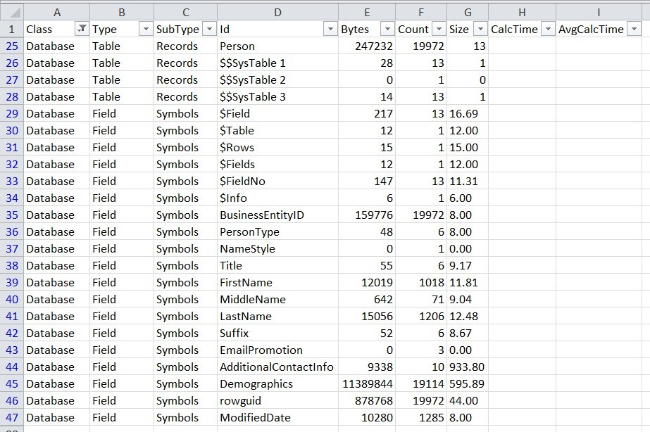
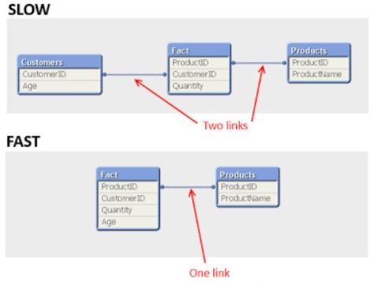
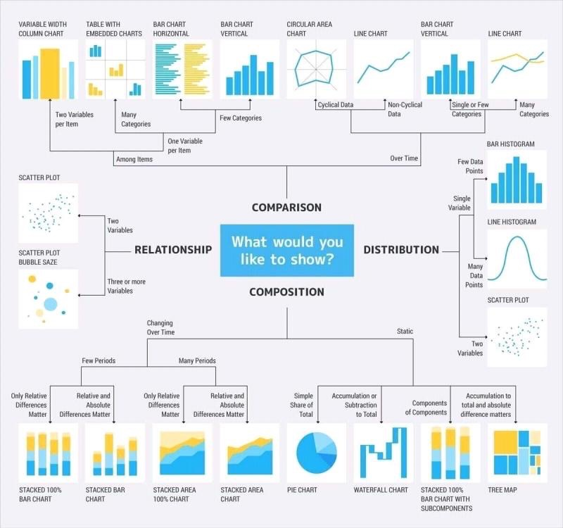

# Qlikview Tips & Tricks

Some Tips and Tricks about Qlikview.

[](http://forthebadge.com)  [](http://forthebadge.com)  [](http://forthebadge.com)  [](http://forthebadge.com)


## Useful documents

* [DocumentAnalyzer_V1.14](./qvw/DocumentAnalyzer_V1.14.qvw) - This document can analyze fields used in another QVW 
* [QvsEditor_v1.2](./qvw/QvsEditor_v1.2.qvw) - This document can edit QVS files (Qlikview scripts)
* [QVD Dictionary V2](./qvw/QVD_Dictionary_V2.qvw) - This document scan QVD/QVW files in order to build a data dictionary
* [Human Resources](./qvw/Human_Resources.qvw) - An example
* [Master Calendar](./qvw/qlik-calendar.qvw) - Build a Master Calendar with Qlikview
* [CSV to QVD generator](./qvw/convert_csv_to_qvd.qvw) - Convert CSV files to QVD files
* [External Expressions](./qvw/external_expressions.qvw) - Outsource Qlikview document expressions
* [Central KPI formula repository](./qvw/kpi_formula_generator.qvw)
* [SQL to QVD generator](./qvw/qvd_generator.qvw) - Convert SQL tables to QVD files

## Useful links

* [EasyQlik QViewer](https://www.easyqlik.com/) - Fast and lightweight QVD Viewer
* [Living QlikView](http://livingqlikview.com/19-tips-all-qlikview-beginners-must-know/)
* [Central KPI formula repository](https://community.qlik.com/t5/Deployment-Framework/Central-KPI-Formula-Repository-solution/td-p/1478681)
* [QlikView Demo](https://demos.qlik.com/qlikview) - Examples of dashboards made with QlikView
* [Qlik Sense Demo](https://demos.qlik.com/qliksense) - Examples of dashboards made with Qlik Sense
* [Living Qlik](http://livingqlikview.com/) - A blog about Qlik
* [QuickIntelligence](https://www.quickintelligence.co.uk/examples/) - Examples of dashboard made with QlikView
* [IPPON Qlikview Blog](https://blog.ipponservices.com/) - A blog about Qlik
* [Qlik Blog](http://www.qlikblog.at/) - Another blog about Qlik
* [World Football Fan App](https://eu-b.demo.qlik.com/QvAJAXZfc/opendoc.htm?document=qvdocs/Choose%20Your%20Champion.qvw&sourceID1=mkto-2014-H1-World-Football)

## Useful tools

* [EasyQlik QViewer](https://www.easyqlik.com/) - Viewer for QVD Files
* [SenseTheme](https://sensetheme.com/) - A theme builder for Qlik Sense
* [Set Analysis Wizard for QlikView](http://tools.qlikblog.at/SetAnalysisWizard/QlikView-SetAnalysis_Wizard_and_Generator.aspx?sa=) - To discover the magic of set analysis
* [Nested If Generator](http://www.qlikblog.at/tools/Nested-If-Generator.html) - The Wonderful world of nested If

## Useful scripts

* Build a calendar
* Play with mapping
* Reset an inputfield

## Useful macros

* Add conditionnal expression to chart
* Set up autozoom
* Change layout 
* Clone a dimension group
* Delete a file
* Dynamic Update
* Export object from hidden sheet to jpg
* Export object to Excel
* Export object to jpg
* Import/Export all variables
* Open a document with current month selection
* Open/Reload/Click/Close
* Read & write a variable
* Run an external program
* Save & exit Qlikview
* Send mail

## Tomorrow I will learn about Qlik

* [Qlik Data Literacy Program](https://www.qlik.com/fr-fr/services/data-literacy-program) - Some free data literacy courses

## Tip 1 : Disable document compression

This will save and load the document faster, but taking up more disk space.



With document compression, my sample weight 1339 Kb.
Without document compression, my sample weight 12 525 Kb.

## Tip 2 : Use partial reloading instead of full reloading

We can limit ourselves to processing the first x rows of a fact table using this method.

```
Let vFirst = 1000;
FIRST $(vFirst) LOAD ...
```

## Tip 3 : Minimize memory usage

A large amount of data requires better control of memory usage. Qlikview automatically detects the data type of the source, but sometimes it is not done correctly and Qlikview allocates more memory than necessary. On a small amount of data, this does not lead to Ccnsequently, it is more annoying when the volume of data increases.

This behavior is mainly due to the fact that Qlikview handles 3 types of data:
* Number
* Text
* Dual

The Number type represents several types of data (integers, decimals) and takes 4 to 8 bytes from memory. The type Text is just a string of characters, which can therefore be any cut. The Dual type is the combination of the 2 previous types, often used for the representation of dates or numeric values with a particular format.

Of these 3 types, the Dual type is the largest consumer of memory, because it stores the representation both digital and textual. The concern is that when Qlikview is unsure of the data type that it needs to process, it defaults to type Dual, even though it's a number.

The purpose of this tip is to make sure that the Dual type is only used when needed (to treat dates for example). To help detect "problem" data, we have the possibility of obtaining memory statistics.



Once the "mem" file has been produced, you can open it with Excel (file with separator tab).



The data that will interest us are the data of the "Database" class (put a filter on it) and then all that remains is to sort the "Bytes" column in descending order, to put the most "memorized" fields.

For Text type fields, we can save a little memory by using the Trim function (allowing you to remove spaces at the start and end of a string).

For numeric values, we can use the Num function which forces the use of the Number type instead by Dual.

Once these optimizations are carried out, we can follow the progress of the work by analyzing the Qlikview memory usage statistics and comparing with the previous export.

## Tip 4 : Denormalize the data model

It is not the easiest to implement because it goes against what we have been able to do and learn so far, but by denormalizing the data, we save time since we reduce the number of joins that Qlikview must handle.

Please note, this method cannot be applied to all tables (mainly small tables containing few expressions).



In the example above, to obtain the consumer's age, a link was created between the "Fact" table and the "Customers" table. By denormalizing, the consumer's age is repatriated in the "Fact" table (a join less).

## Tip 5 : Improve the hardware configuration

Keep in mind that data transformation consumes a lot of memory. To accelerate calculations, we should consider the hardware aspect of the machine performing these calculations, and mainly, on the number of CPU of it. Qlikview uses parallelization on multiple CPUs very efficiently.

We could very well keep the same amount of RAM but double the number of CPUs to have better calculation times.

## Tip 6 : Simulating in QlikView using the Inputfield command

With the INPUTFIELD command, integrated directly into the script, it is now possible to transform any table into an input field. The input field is a classic field with the only difference that its value can be edited directly in the application.

QlikView offers to modify the budget data directly in the dashboard and thus push the reflection on the impact of a change in these budgets (simulation).

To do this, you have to edit the script and insert the "Inputfield" command in front of the field concerned.

It is very important to write this command before loading the field because otherwise all the modifications will be lost each time the data is loaded.

After saving the script and reloading the data, when we hover over the budget cells, we have an input icon that appears. This tells us that we can edit the cell.

The advantage of input fields is that the modifications are made interactively, impacting the entire document and therefore all the graphical representations using this control without having to relaunch the data loading.

However, this feature has some flaws:
* It is not possible to return to the previous value in a cell when the modification has been validated. We must therefore be very careful with the fields that we transform into an edit control since it is quickly possible for an uninformed user to make a document completely inconsistent.
* Number formats are also difficult to manage since it is possible, for example, to insert alphanumeric data despite our input field being initially numeric.
* It is very important to understand that data is modified only in the application and that it is not the database that is impacted.
* You should also be aware that input fields are not intended to contain large amounts of data, as they store data in a much less efficient manner than conventional fields.

The functionality is very powerful and really interesting, especially in the context of simulation, but it must be used wisely and be careful about making this functionality available to the user who could quickly cause the consistency of his data to slip. dashboard.

## Tip 7 : Use the right graphic representation for your data



## Another tips i have too explain ...

1. Diagram Your Data Model
2. The Design Toolbar
3. Save Before Reload
4. Set up Document Logging
5. Iterate
6. Limited Load
7. Use QVD Extracts
8. Use Path Variables
9. Use Standardized Naming Conventions
10. Concatenate Your Fact Tables
11. Mapping Load is Your Friend
12. Limit Your Data
13. Learn to Create a Calendar for Your Apps
14. Tableboxes Are a Development Tool
15. Set up Your Listboxes and Then Copy Sheet
16. Dimensions and Expressions First – Cosmetics Later
17. Put Your Common Expressions into Variables
18. Memorize the Shortcuts
19. Lean on Resources

## Build with

* [Qlikview](https://www.qlik.com/fr-fr/) - Business analytics platform
* [Docker](https://www.docker.com/) - Set of platform as a service (PaaS) products that use OS-level virtualization to deliver software in packages called containers
* [Git](https://git-scm.com) - Open source distributed version control system
* [PostgreSQL](https://www.postgresql.org) - Open source object-relational database system

## Contributing

If you would like to contribute, read the CONTRIBUTING.md file to learn how to do so.